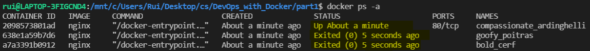
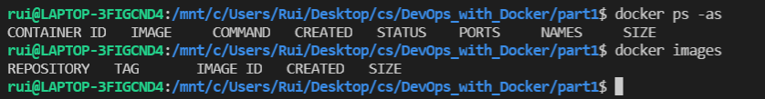

# 1. Image and Containers

## Exercise 1.1 - Getting Started

---

Start 3 containers and stop 2 of them. Use `docker ps -a` to check see all container status.

## Solution

## Exercise 1.2 - Cleanup

---

Remove all images and containers from ex 1.1. Use `docker ps -as` and `docker images` to reveal what is in docker daemon.

## Solution

