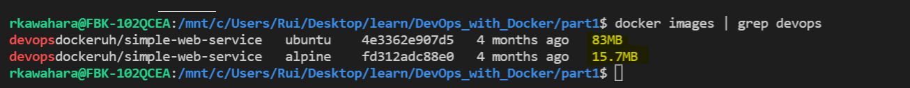
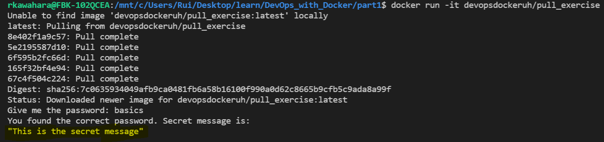

# 3. In Depth Dive to Images 

## Exercise 1.5 - Sizes of Images

Pull ```simple-web-service``` images for Ubuntu and Alpine OS. Compare image size. Confirm that the Alpine has same secret message functionality.

---

## Solution

Ubuntu
``` bash
# Pull docker image for ubuntu
docker pull devopsdockeruh/simple-web-service:ubuntu
```

Alpine
``` sh
# pull docker image for Alpine
docker pull devopsdockeruh/simple-web-service:alpine

# Use image to run Alpine container
docker container run -d -it <alpine_image_id>

# Get inside Alpine container; use "sh" instead of "bash"
docker exec -it <alpine_container_id> sh

# check secret message using commands from exercise 1.3
```

Secret message is:
``` sh
Secret message is: 'You can find the source code here: https://github.com/docker-hy'
```

Size difference:


Alpine - 15.7 MB (smaller)\
Ubuntu - 83 MB

## Exercise 1.6 - Hello Docker Hub

Navigate through Docker Hub and/or Dockerfile to determine input required to retrieve secret message.

[Docker Hub](https://hub.docker.com/r/devopsdockeruh/pull_exercise)

[Dockerfile](https://github.com/docker-hy/docs-exercise/blob/master/Dockerfile)

[Docker Source Docs](https://github.com/docker-hy/docs-exercise)

--- 

## Solution

``` bash
# run given image
docker run -it devopsdockeruh/pull_exercise

# type in password
Give me the password: basics
```

Secret Message - This is the secret message

