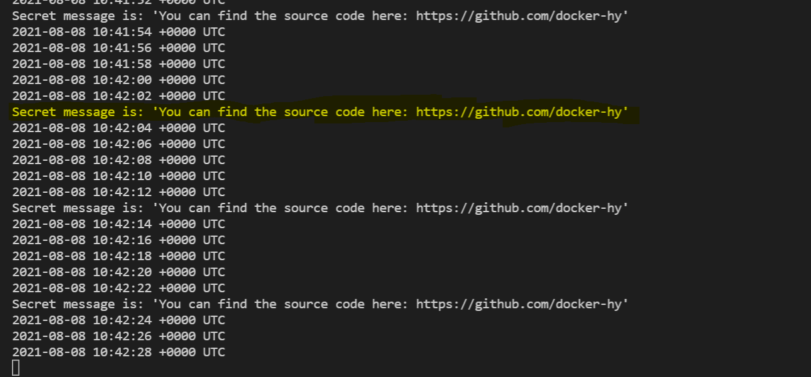
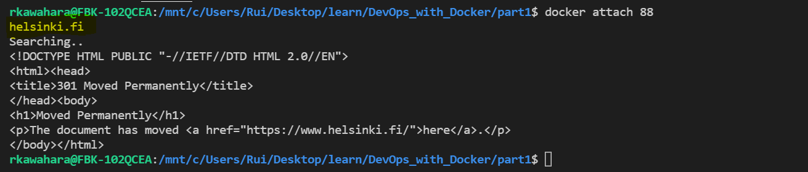

# 2. Running and Stopping Containers

## Exercise 1.3 - Secret Message

---

Install given image and run the container. Retrieve hidden message that exists within container that is running.

## Solution
* Commands
``` docker
# pull required docker image
docker image pull devopsdockeruh/simple-web-service:ubuntu

# run in background while allowing other terminals to access
docker run -d -it devopsdockeruh/simple-web-service:ubuntu 

# get inside container to run bash
docker exec -it <container_id> bash 

# run provided command within docker container
tail -f ./text.log

# kill currently running container from different terminal
docker kill <container_id>
```

* Secret Message



<!--- Secret message is: 'You can find the source code here: https://github.com/docker-hy' -->

## Exercise 1.4 - Missing Dependencies

Use ```curl``` to read the website. Fix any problem along the way.

Command given
``` docker
# use helsinki.fi for website
sh -c 'echo "Input website:"; read website; echo "Searching.."; sleep 1; curl http://$website;'
```

---

## Solution

* Initial set up
``` docker
# run new container
docker run -d -it ubuntu sh -c 'echo "Input website:"; read website; echo "Searching.."; sleep 1; curl http://$website;'

# get inside container
docker exec -it <container_id> bash

#install apt-get and then curl
apt-get update
apt-get install curl
```

* Input website and retrieve curl data
``` docker
# starting process command
docker attach <container_id>

# input web url, even though you don't see "Input website:"
helsinki.fi
```

* Solution Output


_Note:_ "```Input website:```" does not display when ```docker attach``` is used. However, this behavior can be observed when ```docker logs -f``` is used (but will not let you use STDIN).

* Additional notes
``` docker
# in case of incorrect commands, use following to restart container
docker container restart <container_id>

# use following to see all previous outputs
docker logs -f <container_id>
```