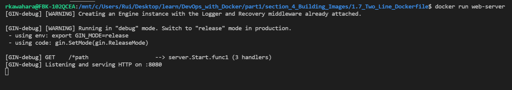

# 4. Building Images

## Exercise 1.7 - Two Line Dockerfile

Write a short Dockerfile that runs following command:
``` docker
docker run devopsdockeruh/simple-web-service:alpine server
```

---

## Solution

First, move to directory that has Dockerfile for this exercise in your terminal. 


* Check you're in right directory
``` bash
# assuming your terminal is bash or sh
pwd

# your output should be this assuming you didn't move Dockerfile
/<your_path>/section_4_Building_Images/1.7_Two_Line_Dockerfile
```

* Command to run Dockerfile and its image/container
``` docker
# build image from Dockerfile, tag as "web-server"
docker build . -t web-server

# run image that you just built
docker run web-server
```

* Output
