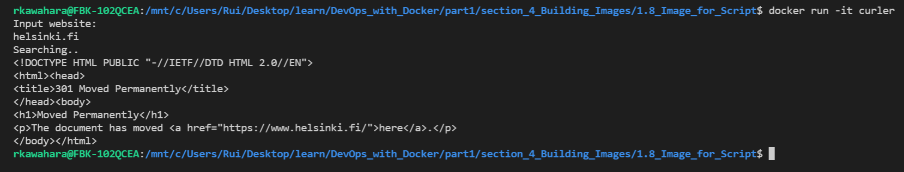

# 4. Building Images

## Exercise 1.8 - Image for script

Create a Dockerfile using ubuntu:18.04 as base. Use script with ```echo "Input website:"; read website; echo "Searching.."; sleep 1; curl http://$website;``` command to build Dockerfile to get curl request for helsinki.fi. 

---

## Solution
* Commands

``` docker
# pull ubuntu:18.04
docker pull ubuntu 18.04

# build from Dockerfile with "curler" tag
docker build . -t curler

# run newly built image
docker run -it curler

# input helsinki.fi
helsinki.fi
```

* Output
