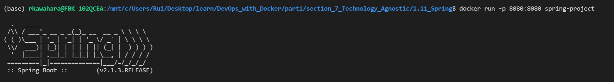
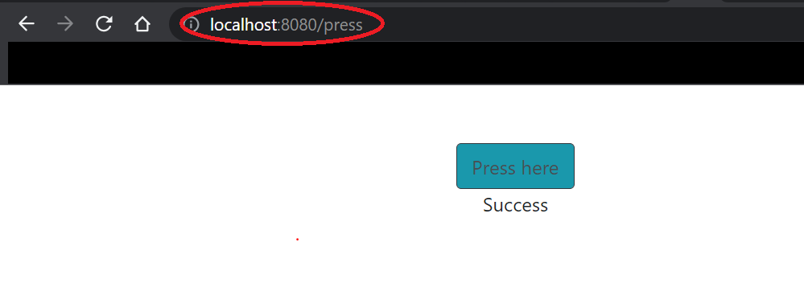

# 7. Technology agnostic

## Exercise 1.11 - Spring

Create `Dockerfile` using [Java Spring Project](https://github.com/docker-hy/material-applications/tree/main/spring-example-project).

Tips: 
- Use [OpenJDK image](https://hub.docker.com/_/openjdk) to install Java
- Pick tag by using README and dockerhub page

---

## Solution

First, make a Dockerfile. For more detail, see `Dockerfile` in this directory.

Use following commands to build and run the `Dockerfile`:

```docker
# build the project. Replace <image_name> with an appropriate name
docker build . -t <image_name>

# Run the image you just built
docker run -p <host_port>:8080 <image_name>
```

Once you run the image, go to `localhost:<host_port>` to see result.

---

## Output

Terminal Output:



Browser Output:

