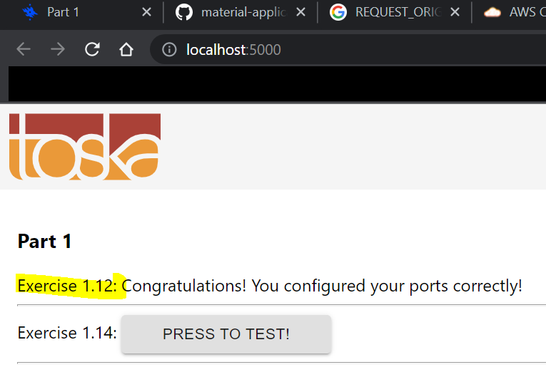

# 8. Front End, Back End, Environment Project

## Exercise 1.12 - Hello, Frontend!

Given [example-frontend](https://github.com/docker-hy/material-applications/tree/main/example-frontend) directory, create `Dockerfile`. Result should be displayed on [http://localhost:5000/](http://localhost:5000/).

--- 

## Solution

Copy `Dockerfile` located in this directory into `example-frontend` directory, navigate inside `example-frontend`, and run the following commands:

```docker
# build Dockerfile
docker build . -t frontend

# run dockerfile
docker run -p 5000:5000 frontend
```

You should see your result in [http://localhost:5000/](http://localhost:5000/) while you are running the container.

---

## Output

Your browser should look something like this:

