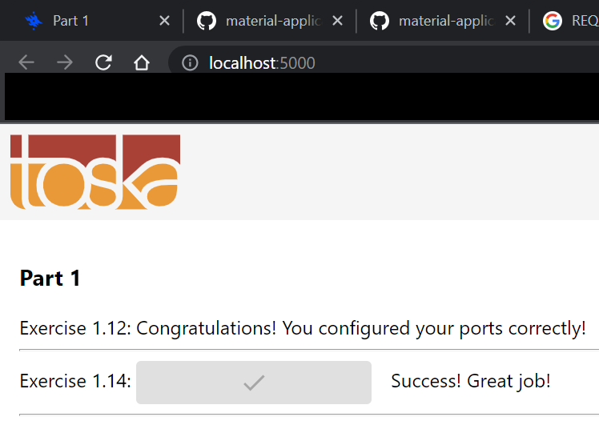

# 8. Front End, Back End, Environment Project

## Exercise 1.14 - Environment

Configure environments for frontend so that it sends request to the backend. Run previous two exercise to acomplish this task.

---

## Solution

__In order for this solution to work, `Dockerfile` must be in correct directory!__

First, copy `Dockerfile` in `fe_dockerfile` into `example-frontend`. Once `Dockerfile` is copied in, move into your `example-frontend` directory and run the following commands:

```docker
# Build dockerfile for frontend
docker build . -t frontend_v2

# Run the frontend container
docker run -p 5000:5000 frontend_v2
```

Then use the different terminal to copy `Dockerfile` in `be_dockerfile` into `example-backend`. This time, go inside your `example-backend` directory and run the following commands:
```docker
# Build dockerfile for backend 
docker build . -t backend_v2

# Run the backend container
docker run -p 8080:8080 backend_v2
```

Once both containers are running simultaneously, go to [http://localhost:5000](http://localhost:5000) to test your anser for 1.14.

To see the implementation of `Dockerfile`, check the ones that are stored in `fe_dockerfile` and `be_dockerfile`


_Note_: `Dockerfile` used in this section is an updated version from ex 1.12 and 1.13.

---

## Output

Output should look like this:

