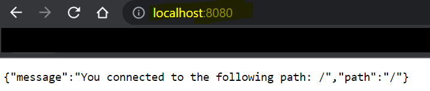

# 1. Migrating to docker-compose.yml

## Exercise 2.2 - Simple-Web-Service using docker-compose 

Create `docker-compose.yml` to start `simple-web-service`. You should see your result in browser. 

---

## Solution

For specific implementation of docker-compose, refer to `docker-compose.yml` located in this directory. 

Make you have `devopsdockeruh/simple-web-service` pulled in. Then simply run `docker-compose up` start the service.

You can see your result on [http://localhost:8080/](http://localhost:8080/)

---

## Output

Your browser should look like this:

