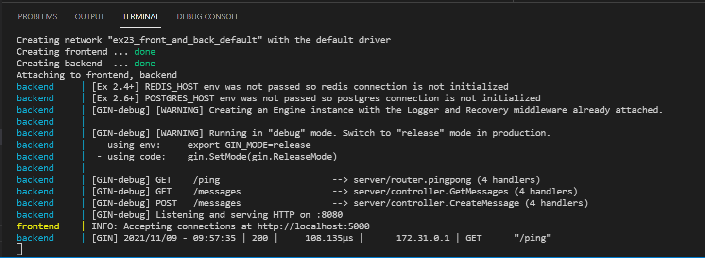

# 1. Migrating to docker-compose.yml

## Exercise 2.3 - Front and Back

Simplify the frontend & backend project (ex.1.4) so that it only uses single `docker-compse.yml` to run.

---

## Solution

You will need a `Dockerfile` from ex 1.4 and `example-front/backend` directories. Make sure your `Dockerfile` is in the right place (e.g `example-frontend` should have `Dockerfile` from `fe_dockerfile` directory). For more info in regards to configuration, refer to  `README.md` in ex 1.4 from Part 1.

_Note: Since `example-frontend` and `example-backend` exist in this directory, you can just copy in `Dockerfile` from 1.4._

Once you have the correct setup, run the docker-compose with `docker-compose.yml`.

For specific implementation of docker-compose, please refer to `docker-compose.yml` located in this directory.

---

## Output

Your terminal should look something like this:
