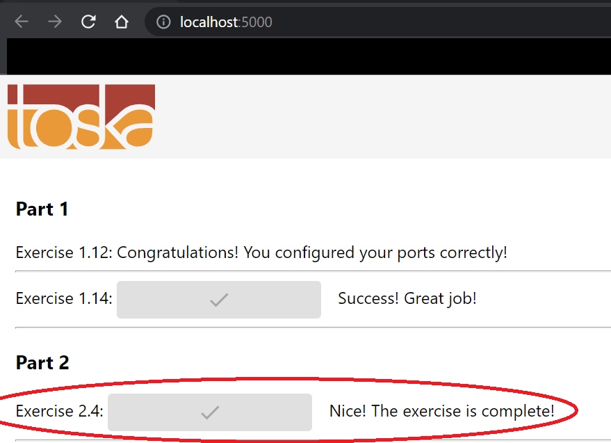

# 2. Docker Networking

## Exercise 2.4 - Intro to Docker Network

Add redis to backend to speed up some operation. Test its result from [frontend](http://localhost:5000). 

Additionally, redis container needs to cache information for the backend.

---

## Solution

To run correctly, copy the `Dockerfile` located in `dockerfile_new_backend` in `example-backend`, which is located above this directory. Rest of the setup is similar to ex 2.3 except that the `example` directories are located above of this directory.

Once everything is set up, run `docker-compose up` to start the program. You should see your result in [localhost:5000](http://localhost:5000)

For specific implementations, refer to `docker-compose.yml` and `Dockerfile` located in this directory.

---

## Output

Your browser should look like this:

