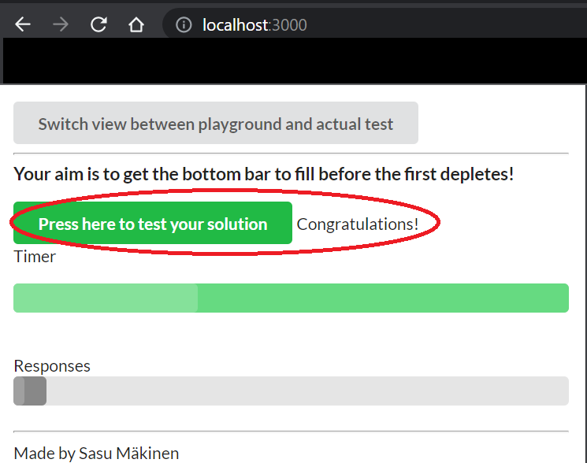

# 3. Scaling

## Exercise 2.5 - Scale the container

Use [this repository](https://github.com/docker-hy/material-applications/tree/main/scaling-exercise) as a starter, which has everything you need. Your goal is to scale the `compute` container. 


Check your solution [here](http://localhost:3000).

---

## Solution

Go inside `scaling-exercise` directory with your terminal and run the following command:

```docker
# run with 5 compute containers
docker-compose up --scale compute=5

# Optional: remove your containers when you're done
docker-compose down
```

You can test your result at [http://localhost:3000](http://localhost:3000)

---

## Output

Your browser should look like this:

