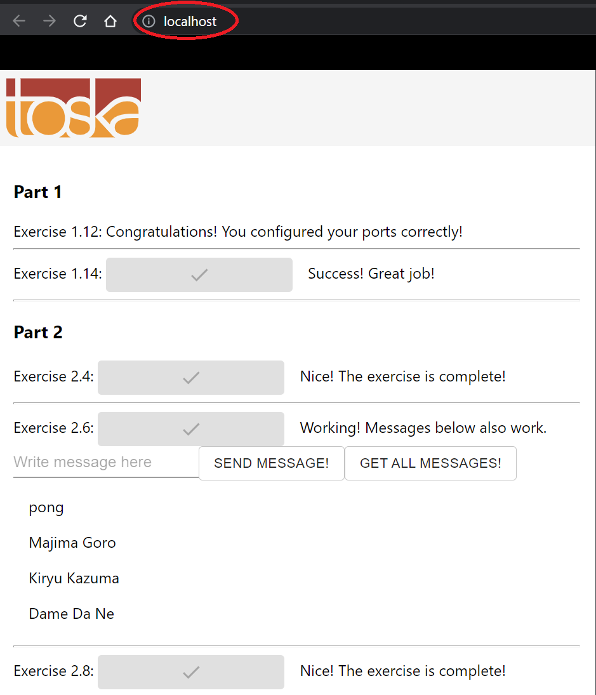

# 4. Larger Application with Volumes

## Exercise 2.10 - Button Repair

Since [proxy exercise](../ex2.8) broke the buttons from previous exercises, fix them. Check your solution on [http://localhost/](http://localhost/) and see if all the buttons work.

Explain the modifications you made and submit `docker-compose.yml`.

*Hint: Use browsers developer consoles to see the difference between proxy version and previous version.*

---

## Solution

### **Modifications**
1. [Dockerfile in example-frontend](Dockerfiles/frontend): Changed  
`ENV REACT_APP_BACKEND_URL` to [http://localhost](http://localhost).
1. [Dockerfile in example-backend](Dockerfiles/backend): Changed `
ENV REQUEST_ORIGIN` to [http://localhost](http://localhost), moved all environment variables above so that it is executed before `RUN go build` command.
1. `docker-compose.yml`:
    - Environment for `frontend` now has `ENV REACT_APP_BACKEND_URL=http://localhost`. 
    - Environment for `backend` now has `ENV REACT_APP_BACKEND_URL=http://localhost`.

Overall, modifications are simply setting connection to proxy server rather than connecting directly to frontend/backend.

### **How to Run**

Assuming you didn't remove the `Makefile`...

Start up using following command:
```docker
# docker-compose up
make
```

and clean up using following command:
```docker
# docker-compose down && docker volume prune
make clean
```

---

## Output

Your browser should something like this:

