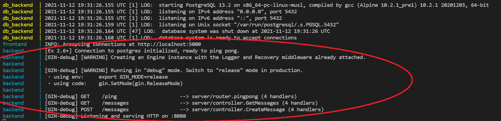
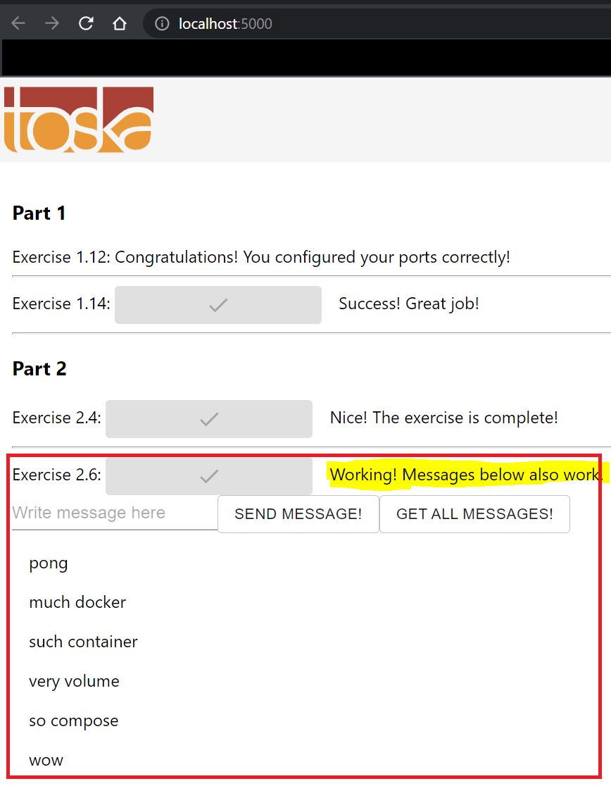

# 4. Larger Application with Volumes

## Exercise 2.6 - Database

Add [postgres database](https://hub.docker.com/_/postgres/) to `example-backend` and send message to yourself. Submit `docker-compose.yml`

---

## Solution

We will continue from 2.6, hence setup is similar.

Once everything is set up, run following command:

```docker
# start
docker-compose up
```

When creating database, it is highly recommended to clean the volumes that were generated. You can use following commands to do so:

```docker
# clean
docker-compose down

# check if you have volume(s)
docker volume ls

# remove volume
docker volume rm <volume_name>

# clean entirely
docker volume prune
```

Alternatively, there is a `Makefile` in this directory for your convenience. You can use them like this:
```Makefile
# docker-compose up
make

# docker-compose down and volume prune 
make clean
```

**Note: When you start up `docker-compose`, make sure to wait until backend & database are ready before checking your answer.**

For specific implementation, refer to `docker-compose.yml` located in this directory.

*Misc. Note* - `Dockerfile` for `redis` is not necessary. It's also unnecessary for ex 2.4 as well.

---

## Output

First, make sure you have on your terminal:


Once backend is running properly, your browser should look like this:

