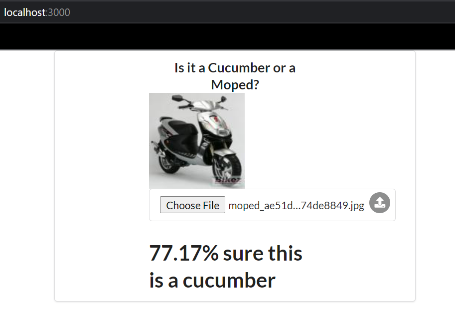

# 4. Larger Application with Volumes

## Exercise 2.7 - Machine Learning 

Configure machine learning project using [frontend](https://github.com/docker-hy/ml-kurkkumopo-frontend), [backend](https://github.com/docker-hy/ml-kurkkumopo-backend), and [training](https://github.com/docker-hy/ml-kurkkumopo-training).

You should see your result in [http://localhost:3000](http://localhost:3000).

*Note: `training` requires 2 volumes and `backend` should share volume `/src/model` with `training`.*

---

## Solution

Before you begin, make sure clone [ml-kurkkumopo-frontend](https://github.com/docker-hy/ml-kurkkumopo-frontend), [ml-kurkkumopo-backend](https://github.com/docker-hy/ml-kurkkumopo-backend), and [ml-kurkkumopo-training](https://github.com/docker-hy/ml-kurkkumopo-training) into this directory.


Then, you can use following command to start up the ML project:
```docker
# option 1 - with compose command
docker-compose up

# option 2 - with Makefile
make
```

When running this for first time, wait several minutes as it will take a long time to build images. You will also notice that `imgs` directory with pictures of cucumbers and mopeds are generated.

Once it's ready, go to [http://localhost:3000](http://localhost:3000) to test your result using images from `imgs` directory.

When you're done, clean up using following command:
```docker
# docker-compose down && docker volume prune
make clean
```

**Note:**
 - Depending on your CPU, it may cause following issue: `Illegal instruction (core dumped)`. If this happens, try downgrading your `Tensorflow`.
 - This is a mock machine learning project, hence it will **NOT** produce good results.

For specific implementation, refer to `docker-compose.yml`

---

## Output

Your browser should look like this once you upload image from `imgs` directory:
