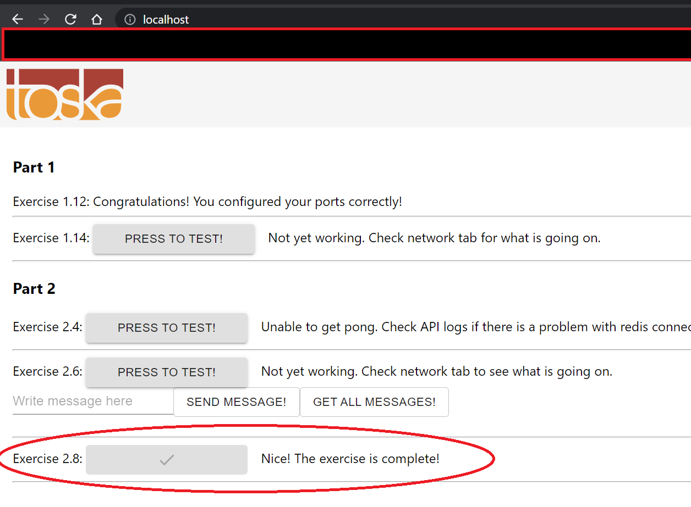

# 4. Larger Application with Volumes

## Exercise 2.8 - Proxy

We will continue from [ex 2.6](../ex2.6_database). 

Use [nginx](https://hub.docker.com/_/nginx) to set a reverse proxy that connects both frontend and backend.

To simplify, your proxy should:
- Take request and send back result instead of frontend.
- Any `/api` requests get redirected to backend.
- Any other requests will get redirected to frontend.
- Must be in same network.

Check your result at [http://localhost](http://localhost).

*Note: Buttons from previous exercises may break, which is fine for this exercise.*

---

## Solution

For your convenience, this directory also has `Makefile` you can use.

To start the `docker-compose`, run the following command:
```Makefile
# this will run docker-compose up
make
```

Once everything starts up, go to [http://localhost](http://localhost) to test 2.8. Do note that all the other buttons from previous exercises will break due to proxy setting. We will fix this in later exercise.

When you're done, run following command to clean:
```Makefile
# this will run docker-compose down and docker volume prune
make clean
```

---

## Output

Your browser should look like this:
