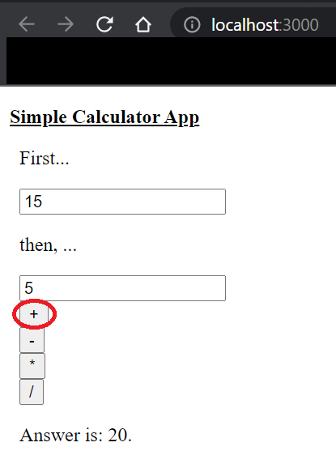
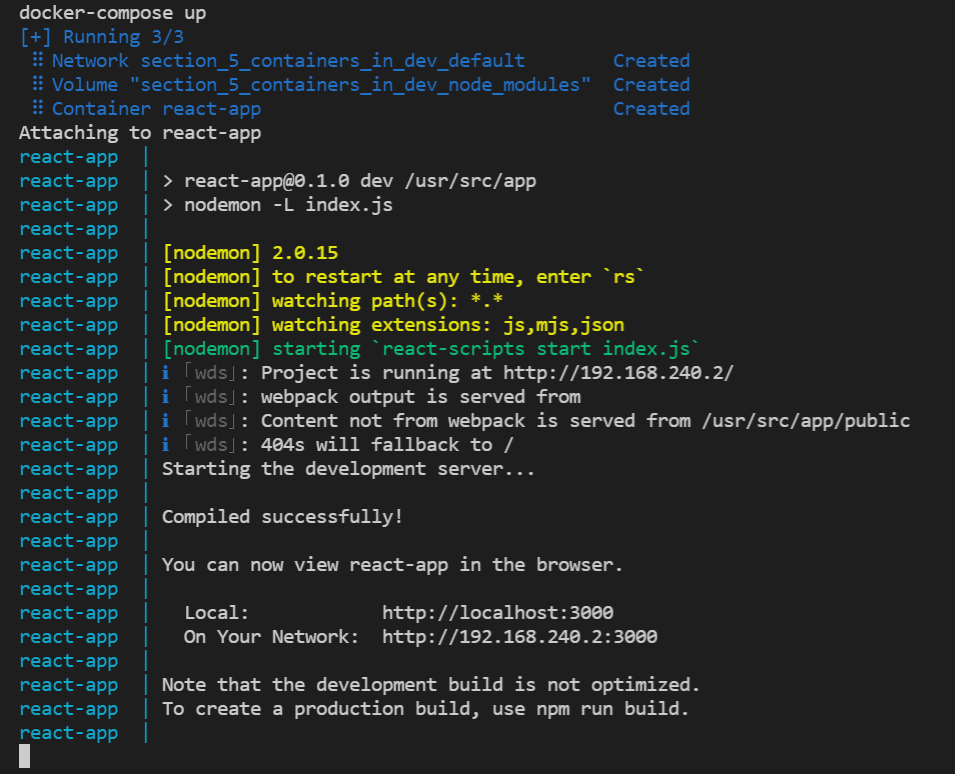

# 5. Containers in Development 

## Exercise 2.11 - Container Utlization

For this exercise, I decided to make a (very) simple web application using React and ran the react app using Docker container.

*Note - solution to this exercise depends on user-to-user. This one of many correct solutions*

---

## Solution

First, I installed react in my environment using `npx create-react-app react-app`. Then removed all the unnecessary files in `src`. Once everything was set, I wrote `Dockerfile` and `docker-compose.yml` to run react in Docker environment. 

Afterwards, I made sure to install `nodemon` for smoother development and configured setting in `package.json`. 

*Note - `nodemon` package seems to have issue with container environment when using Windows as a host. While not ideal, I've used `-L` flag to make sure that `nodemon` works.*

Once `nodemon` was working, I modified `index.js` to develop simple calculator application, which you can see in output.

To run this project, use following command:
```docker
# docker-compose up
make
```

and clean using following command when done:
```docker
# docker-compose down && docker volume prune
make clean
```

For specific implementation, refer to files (e.g. `Dockerfile`, `docker-compose.yml`, etc.) in this directory.

---

## Output

My output for this app looks like this in browser:



My terminal looks like this:

