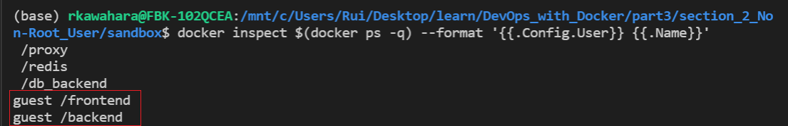

# 2. Non-Root User

## Exercise 3.3 - Add User Settings to Front/Backend

Frontend and backend project that was made in previous parts starts from root. Add a security feature so that the containers start from non-root user.

---

## Solution

For this exercise, I've added the following lines at the end of frontend/backend `Dockerfile`:

``` Dockerfile
RUN useradd -m guest # adds user named "guest"
RUN chown -R guest . # give all ownership to "guest"
USER guest           # activate "guest" user
```

Once `Dockerfile` is modified and are located in appropriate directory, run the `docker-compose` and you will notice that it works just as good as it did in ex 2.10.

To check the ownership, use following command:
```docker
docker inspect $(docker ps -q) --format '{{.Config.User}} {{.Name}}'
```

For specific implementation, refer to `Dockerfile` located in `dockerfiles` directory.

---

## Output



As you can see, frontend and backend containers are activated as `guest` user.