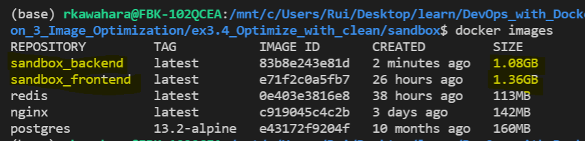

# 3. Optimizing Dockerfile

## Exercise 3.4 - Cleaning Frontend/Backend Dockerfile

Frontend and backend project from previous parts are not optimized. Clean up Dockerfiles so that the image takes less space.

---

## Solution

Following are the new implementation for optimized images:

### **Frontend**
```Dockerfile
# Docker image from dockerhub
FROM node:14

# port to be exposed
EXPOSE 5000

# Defacto starting dir
WORKDIR /usr/src/app

# Copy contents example-frontend into this container
COPY . .

# ex 1.14 - set env to connect to backend
ENV REACT_APP_BACKEND_URL=http://localhost:8080

# Bind all RUN command into one line (ex 3.4)
RUN npm install && \
    npm run build && \
    npm install -g serve && \
    npm uninstall npm -g && \
    useradd -m guest && \
    chown -R guest .

USER guest

# Server project in port 5000
CMD ["serve", "-s", "-l", "5000", "build"]
```

### **Backend**
```Dockerfile
# Install golang 1.16
FROM golang:1.16

# Set port to 8080
EXPOSE 8080

# Choose working directory
WORKDIR /usr/src/app

# Copy contents of 'example-backend' in container. 
# Make sure you are in correct directory.
COPY . .

# Set environment variable to your localhost. Add port for 1.14
# Also bind all RUN command into one line (ex 3.4)
ENV REQUEST_ORIGIN=http://localhost:5000 \
    REDIS_HOST=redis


# Bind all RUN command into one line (ex 3.4)
RUN go build && \
    useradd -m guest && \
    chown -R guest .

USER guest

# Execute
CMD ["./server"]
```

---

## Output

### *Previous Implementation:*


### *Current Implementation:*


**NB:** *I used `node` for frontend and `golang` for backend instead of using `ubuntu:18.04`* 

With new implementation, we see the following improvements:
- `Frontend`: 1.36 GB -> 1.18 GB
- `Backend`: 1.08 GB -> 1.07 GB
