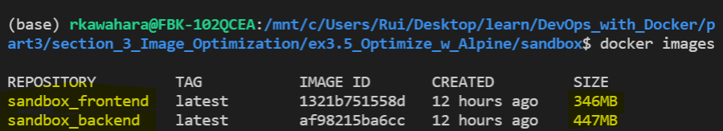

# 3. Optimizing Dockerfile

## Exercise 3.5 - Alpine Variant 

Optimize the images in such way that:
- Frontend image uses `alpine` variant of `node`
- Backend image uses `alpine` variant of `golang`

---

## Solution

Following are the new implementation of optimized images:

### **Frontend**
```Dockerfile
# Optimize using alpine (ex 3.5)
FROM node:14-alpine

# port to be exposed
EXPOSE 5000

# Defacto starting dir
WORKDIR /usr/src/app

# Copy contents example-frontend into this container
COPY . .

# ex 1.14 - set env to connect to backend
ENV REACT_APP_BACKEND_URL=http://localhost:8080

# Modified to meet criteria for alpine version
RUN npm install && \
    npm run build && \
    npm install -g serve && \
    adduser -D userapp && \
    chown -R userapp .

USER userapp

# Server project in port 5000
CMD ["serve", "-s", "-l", "5000", "build"]
```

### **Backend**
```Dockerfile
# Optimize using alpine (ex 3.5)
FROM golang:1.16-alpine

# Set port to 8080
EXPOSE 8080

# Choose working directory
WORKDIR /usr/src/app

# Copy contents of 'example-backend' in container. 
COPY . .

# Set environment variable to your localhost. Add port for 1.14
# Also bind all RUN command into one line (ex 3.4)
ENV REQUEST_ORIGIN=http://localhost:5000 \
    REDIS_HOST=redis

# Bind all RUN command into one line (ex 3.4)
RUN go build && \
    adduser -D userapp && \
    chown -R userapp .

USER userapp

# Execute
CMD ["./server"]
```

---

## Output

### *Previous Implementation: (from last exercise)*


### *Current Implementation:*


With alpine variant, we see the following improvements:
- `Frontend`: 1.18 GB -> 346 MB
- `Backend`: 1.07 GB -> 447 MB
