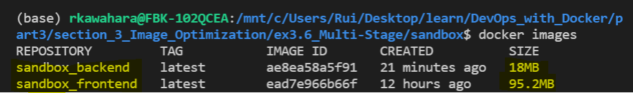

# 3. Optimizing Dockerfile

## Exercise 3.6 - Multi-Stage Builds

This exercise is divided into two parts:

**Part 1 - Frontend**

Do a multi-stage build for frontend project. You must:
- Build with [README instruction](https://github.com/docker-hy/material-applications/tree/main/example-frontend).
- Store build assets in `build` folder.

**Part 2 - Backend**

Do a multi-stage build for backend project. You must:
- Build binary in build stage.
- Run the binary from `scratch`.
- Image must be less than 25 MB

---

## Solution

Following are the new implementation of optimized images:

### **Frontend**
```Dockerfile
# Use node to build
FROM node:14 as build-stage

# Define workspace
WORKDIR /usr/src/app

# Copy conents of 'example-frontend' in build-stage
COPY . .

# Install npm and build; generates ./build
RUN npm install && \
    npm run build 


# Use alpine for minimal size container
FROM alpine:latest

# Set port to 5000
EXPOSE 5000

# Define workspace
WORKDIR /usr/src/app

# Copy /build directory from node container to alpine container
COPY --from=build-stage /usr/src/app/build  ./build

# Set environment variable
ENV REACT_APP_BACKEND_URL=http://localhost:8080

# Add npm, install serve, add user setting
RUN apk add --no-cache npm && \
    npm install -g serve && \
    adduser -D userapp && \
    chown -R userapp .

# Activate non-root user
USER userapp

# Activate frontend
CMD ["serve", "-s", "-l", "5000", "build"]
```

### **Backend**
```Dockerfile
# Use alpine golang for build stage
FROM golang:1.16-alpine as build-stage

# Choose working directory
WORKDIR /usr/src/app

# Copy contents of 'example-backend' in container. 
COPY . .

# Build go (based on simple-web-server example) & add user
RUN CGO_ENABLED=0 GOOS=linux GOARCH=amd64 go build && \
    adduser -D userapp && \
    chown -R userapp .

FROM scratch

# Set port to 8080
EXPOSE 8080

# Set environment variable to your localhost. 
ENV REQUEST_ORIGIN=http://localhost:5000 \
    REDIS_HOST=redis

# Copy password from build stage to scratch container
COPY --from=build-stage /etc/passwd /etc/passwd

# Copy built item from build-stage to scratch container
COPY --from=build-stage /usr/src/app/server /usr/src/app/server

# define workspace
WORKDIR /usr/src/app/

# activate non-root user
USER userapp

# Use ENTRYPOINT to activate backend
ENTRYPOINT [ "/usr/src/app/server" ]
```

---

## Output

### *Previous Implementation: (from last exercise)*


### *Current Implementation:*


With alpine variant, we see the following improvements:
- `Frontend`: 346 MB -> 95.2 MB
- `Backend`: 447 MB -> 18 MB
