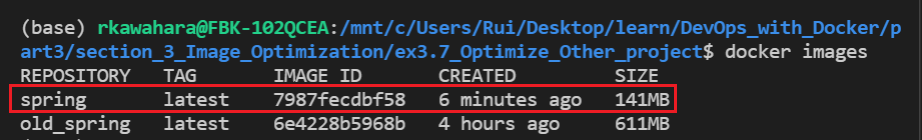

# 3. Optimizing Dockerfile

## Exercise 3.7 - Optimize Misc. Project 

Using techniques presented in this section, optimize project(s) from previous exercise. For this project, I will be using Spring project from exercise 1.11.

---

## Solution

### How to Run

I've provided makefile for your convenience. Run following commands:

```Docker
# Builds image and runs container
make

# Prunes container and removes image that you just made
make clean
```

To check result, you will need to go to [localhost at port 8080](http://localhost:8080/).


For specific implementation, please refer to `Dockerfile` included in this directory. I've also included the old implementation (`Dockerfile.single-stage`) as well for your reference.

---

## Output

### *Size Comparison:*


With multi-stage implementation, you can see the following result:
- `Spring Image`: 611 MB -> 141 MB
