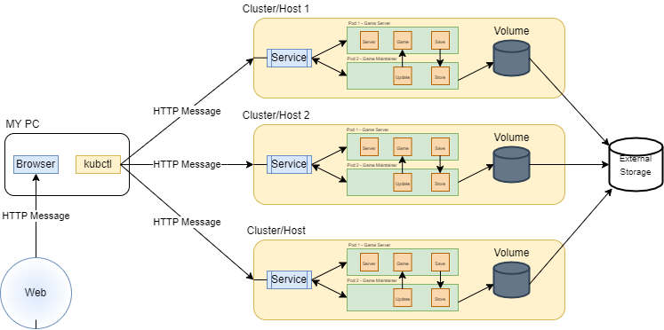

# 3. Optimizing Dockerfile

## Exercise 3.8 - Multi-Host Environment

Make a diagram to test your understanding of K8s. 

Following are the conditions that needs to meet:
- Have at least 3 host in K8s cluster.
- Each cluster must run at least 2 apps.
- Must utilize other machine or API that are not in the clusters.
- Include my computer for app deployment.
- HTTP coming from web to my cluster and how it reaches to app. 

---

## Solution

### Diagram

### Detail

This is a simple video game environment ran in Kubernetes. From my machine, I am able to use `kubctl` to send data that I got from web to each cluster.

Each cluster you see in diagram represents individual player's host machine. Cluster first takes in the message from my machine via `kubctl` and pass it in Kubernetes' service for specific insturction. It then sends the data to one of two pods: Game Server Pod and Game Maintainer Pod.

Game Server Pod is what player uses to play the actual game. There are three containers to maintain this pod, which are:
- Server Container: Connects online to play with other players on web.
- Game Container: Contains the actual game.
- Save Data Container: Temporary storage for your game progress.

On the otherhand, Game Maintainer Pod has a feature that maintains the other pod. It has two containers:
- Updater Container: Updates the main game (e.g. Applies patch, DLC, etc).
- Storage Container: Takes in data from Save Data Container and pushs the changes into pods' volume.

Each pods should have a volume that will store each pods' crucial information. It also sends its data to external storage for backup purpose.